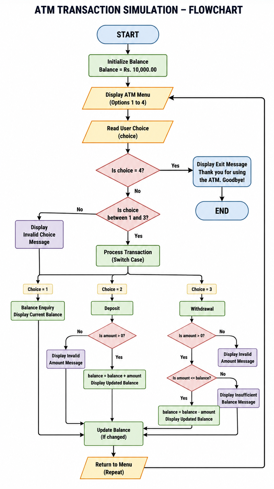
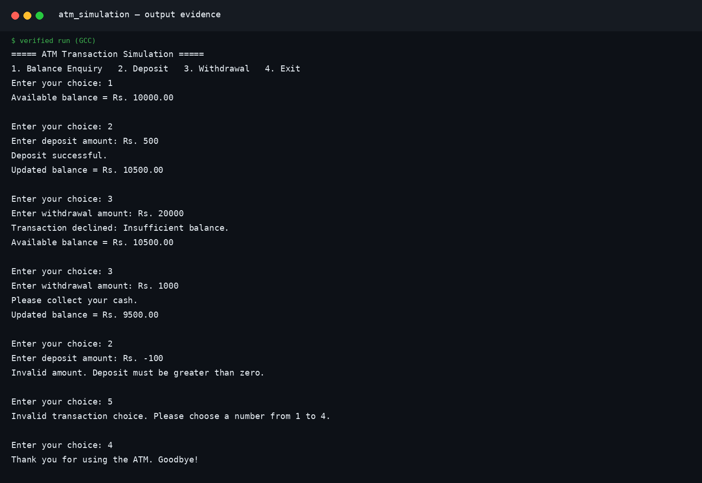

# ATM Transaction Simulation

## Programming with C — Unit 1

**Student:** Vishal Prajapati  
**Roll Number:** `FDAI044-A`  
**Class:** FY-BSC AI  
**Faculty In-charge:** Dr. Kishor Mahajan  
**Institution:** KES' Shroff College  
**Subject:** Programming with C

**Complete Report:** [View the complete ATM Transaction Simulation report](Assignment.pdf)

[](https://en.cppreference.com/w/c)
[](https://en.cppreference.com/w/c/language/do)
[](https://github.com/codeXparadise/Assignments)

[← Back to Unit 1 Index](../)

---

## Project Overview

The ATM Transaction Simulation is a menu-driven C console application that demonstrates repeated transaction processing with a `do-while` loop and menu selection with a `switch` statement. It supports balance enquiry, deposit, withdrawal, and exit.

The account begins with an initial balance of **Rs. 10,000.00**. Successful deposits and withdrawals update the balance. Zero and negative transaction amounts are rejected, and a withdrawal greater than the available balance is declined without changing the account state.

## Problem Statement

Develop an ATM simulation using a `do-while` loop and `switch`. The program must provide options for balance enquiry, deposit, withdrawal, and exit. It must reject invalid transaction amounts, prevent withdrawals larger than the available balance, and continue displaying the menu until the user explicitly selects Exit.

## Objectives

| Objective | Implementation |
|---|---|
| Display the menu at least once | `do-while` loop |
| Select a transaction | `switch(choice)` |
| Maintain an account balance | `double balance = 10000.00` |
| Validate deposits and withdrawals | Require `amount > 0` |
| Prevent excessive withdrawals | Compare `amount > balance` |
| Terminate under user control | Exit when choice is `4` |

## Menu and Balance Rules

| Option | Transaction | Effect on balance |
|---:|---|---|
| 1 | Balance enquiry | No change; display current balance |
| 2 | Deposit | `balance = balance + amount` |
| 3 | Withdrawal | Subtract only when sufficient funds are available |
| 4 | Exit | End the program |

## Algorithm

1. Set the initial balance to Rs. 10,000.00.
2. Display the ATM menu and read the user’s choice.
3. Use `switch(choice)` to select the requested transaction.
4. For balance enquiry, display the current balance.
5. For deposit, accept the amount only when it is greater than zero, then add it to the balance.
6. For withdrawal, accept the amount only when it is greater than zero and does not exceed the balance.
7. Display an error message for invalid choices or invalid transaction amounts.
8. Repeat while the user’s choice is not `4`.

## Flowchart

The flowchart uses standard symbols: rounded rectangles for Start/End, parallelograms for Input/Output, rectangles for Processing, diamonds for Decisions, and a circular connector for the repeated ATM menu path.



*Figure 1. ATM Transaction Simulation program flowchart.*

## Compilation and Execution

```bash
gcc atm_simulation.c -o atm_simulation
./atm_simulation
```

## Verified Test Cases

The program was compiled and executed with test inputs covering the initial balance, successful deposit, excessive withdrawal, successful withdrawal, invalid amount handling, invalid choice handling, and termination.

| Test | Input | Expected / verified result |
|---:|---|---|
| 1 | Choice 1 | `Available balance = Rs. 10000.00` |
| 2 | Choice 2; `Rs. 500` | `Updated balance = Rs. 10500.00` |
| 3 | Choice 3; `Rs. 20000` | Insufficient-balance transaction decline |
| 4 | Choice 3; `Rs. 1000` | `Updated balance = Rs. 9500.00` |
| 5 | Choice 2; `Rs. -100` | Invalid deposit amount message |
| 6 | Choice 5 | Invalid transaction choice message |
| 7 | Choice 4 | Exit message |

## Output Screenshot

The following dark-mode terminal screenshot is attached for GitHub viewing and code-output presentation. The white/light version is reserved for the printable DOCX report.



*Figure 2. Verified ATM Simulation output in dark terminal mode for GitHub.*

## Project Files

| File | Purpose |
|---|---|
| [`atm_simulation.c`](./atm_simulation.c) | Complete C source code |
| [`Assignment_2_ATM_Transaction_Simulation.docx`](./Assignment_2_ATM_Transaction_Simulation.docx) | Professional documentation report containing algorithm, logic, flowchart, code, tables, and output evidence |
| [`atm_flowchart.png`](./assets/atm_flowchart.png) | Standard-symbol program flowchart |
| [`atm_output_dark.png`](./assets/atm_output_dark.png) | Dark-mode verified output screenshot attached to this README |
| [`atm_output_light.png`](./assets/atm_output_light.png) | White/light verified output screenshot embedded in the DOCX report |

## Concepts Demonstrated

The assignment demonstrates `do-while` repetition, `switch` selection, formatted input/output, relational operators, validation conditions, persistent program state, balance updates, error handling, and controlled termination.

## References

1. [C language and standard library reference — cppreference.com](https://en.cppreference.com/w/c)
2. [`switch` statement reference — cppreference.com](https://en.cppreference.com/w/c/language/switch)
3. [`do-while` loop reference — cppreference.com](https://en.cppreference.com/w/c/language/do)

---

**Maintained by Vishal Prajapati · FDAI044-A · FYBSC AI**
