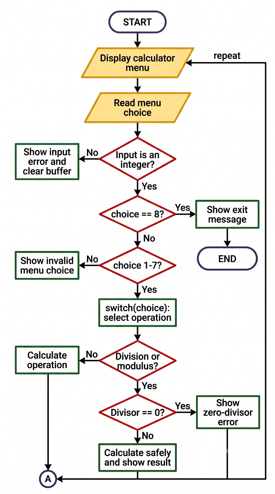
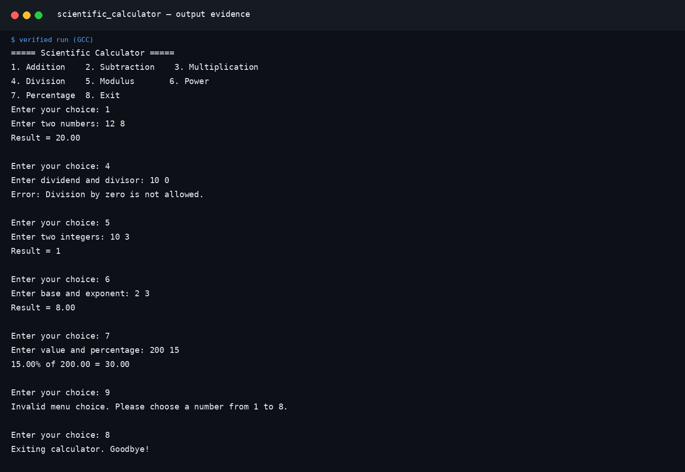

# Scientific Calculator

## Programming with C — Unit 1

**Student:** Vishal Prajapati  
**Roll Number:** `FDAI044-A`  
**Class:** FY-BSC AI  
**Faculty In-charge:** Dr. Kishor Mahajan  
**Institution:** KES' Shroff College  
**Subject:** Programming with C

**Complete Report:** [View the complete Scientific Calculator report](Assignment.pdf)

[](https://en.cppreference.com/w/c)
[](https://en.cppreference.com/w/c/language/switch)
[](https://github.com/codeXparadise/Assignments)

[← Back to Unit 1 Index](../)

---

## Project Overview

The Scientific Calculator is a menu-driven console application written in C. It uses a `switch` statement to select one of seven arithmetic operations and a `do-while` loop to continue processing until the user chooses Exit.

The program supports addition, subtraction, multiplication, division, modulus, power, and percentage calculation. It also validates invalid menu input, division by zero, and modulus by zero. Real-number operations use `double`; modulus uses integer operands because the C `%` operator calculates an integer remainder.

## Problem Statement

Design a menu-driven C calculator that performs addition, subtraction, multiplication, division, modulus, power calculation, and percentage calculation using a `switch` statement. The program must handle division by zero, modulus by zero, invalid menu choices, and repeated calculations until the user selects Exit.

## Objectives

| Objective | Implementation |
|---|---|
| Select an operation from a numbered menu | `switch(choice)` |
| Support arithmetic operations | Cases 1–7 |
| Prevent unsafe division | Check `b == 0` before division |
| Prevent unsafe modulus | Check `intB == 0` before `%` |
| Handle invalid menu choices | `default` case |
| Continue until termination | `do-while` loop with choice `8` |

## Menu and Input Specification

| Option | Operation | Required input |
|---:|---|---|
| 1 | Addition | Two real numbers |
| 2 | Subtraction | Two real numbers |
| 3 | Multiplication | Two real numbers |
| 4 | Division | Dividend and divisor |
| 5 | Modulus | Two integers |
| 6 | Power | Base and exponent |
| 7 | Percentage | Value and percentage |
| 8 | Exit | No additional input |

## Algorithm

1. Display the calculator menu.
2. Read the user’s menu choice.
3. If the choice is not an integer, clear the invalid input and display an error message.
4. Use `switch(choice)` to select the requested operation.
5. Validate the divisor before division or modulus.
6. Calculate and display the result, or display the relevant error message.
7. Repeat the menu until the user selects option `8`.

## Flowchart

The flowchart uses standard symbols: rounded rectangles for Start/End, parallelograms for Input/Output, rectangles for Processing, diamonds for Decisions, and a circular connector for the repeated menu path.



*Figure 1. Scientific Calculator program flowchart.*

## Compilation and Execution

Compile the program with GCC and link the math library because the power operation uses `pow()` from `math.h`.

```bash
gcc scientific_calculator.c -o scientific_calculator -lm
./scientific_calculator
```

## Verified Test Cases

The program was compiled and executed with test inputs covering normal operations, safety validation, invalid menu handling, and termination.

| Test | Input | Expected / verified result |
|---:|---|---|
| 1 | Choice 1; `12 8` | `Result = 20.00` |
| 2 | Choice 4; `10 0` | `Error: Division by zero is not allowed.` |
| 3 | Choice 5; `10 3` | `Result = 1` |
| 4 | Choice 6; `2 3` | `Result = 8.00` |
| 5 | Choice 7; `200 15` | `15.00% of 200.00 = 30.00` |
| 6 | Choice 9 | Invalid menu choice message |
| 7 | Choice 8 | Exit message |

## Output Screenshot

The following dark-mode terminal screenshot is attached for GitHub viewing and code-output presentation. The white/light version is reserved for the printable DOCX report.



*Figure 2. Verified Scientific Calculator output in dark terminal mode for GitHub.*

## Project Files

| File | Purpose |
|---|---|
| [`scientific_calculator.c`](./scientific_calculator.c) | Complete C source code |
| [`Assignment_1_Scientific_Calculator.docx`](./Assignment_1_Scientific_Calculator.docx) | Professional documentation report containing algorithm, logic, flowchart, code, tables, and output evidence |
| [`calculator_flowchart.png`](./assets/calculator_flowchart.png) | Standard-symbol program flowchart |
| [`calculator_output_dark.png`](./assets/calculator_output_dark.png) | Dark-mode verified output screenshot attached to this README |
| [`calculator_output_light.png`](./assets/calculator_output_light.png) | White/light verified output screenshot embedded in the DOCX report |

## Concepts Demonstrated

The assignment demonstrates `switch` selection, `do-while` repetition, `double` and `int` data types, arithmetic operators, `pow()`, input-buffer clearing, validation, formatted output, and controlled program termination.

## References

1. [C language and standard library reference — cppreference.com](https://en.cppreference.com/w/c)
2. [`switch` statement reference — cppreference.com](https://en.cppreference.com/w/c/language/switch)
3. [`do-while` loop reference — cppreference.com](https://en.cppreference.com/w/c/language/do)
4. [C mathematical functions reference — cppreference.com](https://en.cppreference.com/w/c/numeric/math)

---

**Maintained by Vishal Prajapati · FDAI044-A · FY-BSC AI**
