# Smart Campus Management System

## Database Management Systems (DBMS) — Complete Project Reference

**Student:** Vishal Prajapati  
**Roll Number:** `FDAI044-A`  
**Class:** FY-BSC AI  
**Subject:** Database Management Systems (DBMS)  
**Faculty In-charge:** Onkar Raotole  
**Submission Date:** 31 August 2026

**Complete Report:** [View the complete Smart Campus Management System report](Report.pdf)

[](https://dev.mysql.com/doc/refman/8.0/en/) [](./smart_campus_management.sql) [](./Smart_Campus_Management_System_Complete_Reference_Report.docx)

> This README is the GitHub version of the complete reference DOCX. Written explanations are concise enough for manual copying, while every SQL query is paired with its independently verified output screenshot. Files marked **PRINT THIS ASSET** are intended to be printed and attached rather than handwritten.

---

## Project Files

| File or folder | Purpose |
|---|---|
| [`Smart_Campus_Management_System_Complete_Reference_Report.docx`](./Smart_Campus_Management_System_Complete_Reference_Report.docx) | Complete 40-page Part A–F reference report |
| [`smart_campus_management.sql`](./smart_campus_management.sql) | Full DDL, seed data, and 45 SQL queries |
| [`assets/code_screenshots/`](./assets/code_screenshots/) | White-theme printable screenshots of all SQL source-code pages |
| [`assets/query_outputs/`](./assets/query_outputs/) | Individual white-theme output screenshot(s) for every query |
| [`assets/smart_campus_er_diagram.png`](./assets/smart_campus_er_diagram.png) | ER diagram for Part B |
| [`assets/smart_campus_workflow.png`](./assets/smart_campus_workflow.png) | Project workflow diagram |
| [`FYAIDBMSASSIGNMENT.pdf`](./FYAIDBMSASSIGNMENT.pdf) | Teacher-provided assignment brief |

## PART A — REQUIREMENT ANALYSIS

### Objectives
The objective is to design and implement a relational Smart Campus Management System. The system centralizes academic, attendance, examination, result, and placement information while applying keys, constraints, normalization, and SQL queries for reliable data management.

### Users of the System

| User | Responsibility |
|---|---|
| Administrator | Maintains database structure, departments, users, and records. |
| Faculty | Views course rosters and records attendance and marks. |
| Student | Views profile, attendance, results, and placement information. |
| Placement Officer | Manages drives, eligibility, and application status. |

### Functional and Non-Functional Requirements

| Type | Requirement |
|---|---|
| Functional | Store, search, update, delete, and report campus data. |
| Integrity | Apply PRIMARY KEY, FOREIGN KEY, UNIQUE, NOT NULL, CHECK, and DEFAULT constraints. |
| Performance | Support routine reports using relational queries. |
| Scalability | Allow additional students, departments, courses, and drives. |
| Maintainability | Use clear names, normalized tables, and documented SQL. |

## PART B — DATABASE DESIGN

### Selected Modules

| Module | Tables | Purpose |
|---|---|---|
| Student Management | `Student` | Identity, admission, contact, and CGPA |
| Faculty Management | `Faculty` | Faculty, department, designation, and salary |
| Attendance | `Attendance` | Attendance by student, course, and date |
| Examination and Result | `Examination`, `Result` | Exam schedules, marks, and grades |
| Placement Cell | `Placement_Drive`, `Placement_Record` | Drives, eligibility, packages, and applications |

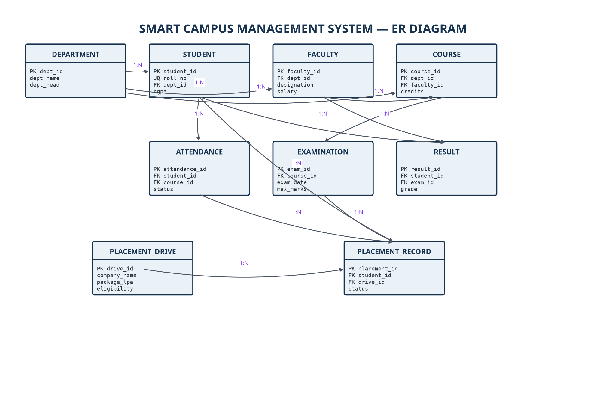

*Figure B1. Entity-Relationship diagram. **PRINT THIS ASSET** for the report.*

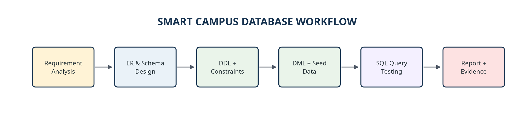

*Figure B2. Project workflow. **PRINT THIS ASSET** for the report.*

### Relational Schema and 3NF

| Table | Primary key | Foreign key mapping |
|---|---|---|
| Department | `dept_id` | — |
| Student | `student_id` | `dept_id` → Department |
| Faculty | `faculty_id` | `dept_id` → Department |
| Course | `course_id` | `dept_id` → Department; `faculty_id` → Faculty |
| Attendance | `attendance_id` | `student_id` → Student; `course_id` → Course |
| Examination | `exam_id` | `course_id` → Course |
| Result | `result_id` | `student_id` → Student; `exam_id` → Examination |
| Placement_Drive | `drive_id` | — |
| Placement_Record | `placement_id` | `student_id` → Student; `drive_id` → Placement_Drive |

| Normal form | Applied rule |
|---|---|
| 1NF | Every field stores one atomic value and each row has a primary key. |
| 2NF | Non-key attributes depend on the complete key; transaction tables use unique combinations. |
| 3NF | Department and faculty information are separated to remove transitive dependencies. |

## PART C — DATABASE IMPLEMENTATION

The source creates the `smart_campus_db` database and nine related tables. The complete SQL is kept in the separate source file so it can be printed as the code appendix.

```sql
DROP DATABASE IF EXISTS smart_campus_db;
CREATE DATABASE smart_campus_db;
USE smart_campus_db;
```

| Constraint | Example | Purpose |
|---|---|---|
| PRIMARY KEY | `student_id INT PRIMARY KEY` | Unique row identity |
| FOREIGN KEY | `REFERENCES Department(dept_id)` | Referential integrity |
| UNIQUE | `roll_no UNIQUE` | Prevents duplicates |
| NOT NULL | `full_name NOT NULL` | Requires essential data |
| CHECK | `cgpa BETWEEN 0 AND 10` | Validates allowed values |
| DEFAULT | `status DEFAULT 'Applied'` | Provides a safe fallback |

## PART D — DATA ENTRY

The initial seed data contains the following records. Demonstration DELETE statements later remove selected rows, so the final post-script row count can be lower in affected tables.

| Table | Initial inserted records |
|---|---:|
| Department | 6 |
| Student | 20 |
| Faculty | 20 |
| Course | 20 |
| Attendance | 30 |
| Examination | 20 |
| Result | 25 |
| Placement_Drive | 15 |
| Placement_Record | 20 |

## PART E — SQL QUERIES

The published source includes exactly 45 queries: 10 retrieval, 5 aggregate, 5 JOIN, 5 nested, 5 UPDATE, 5 DELETE, 5 ALTER TABLE, and 5 pattern-matching queries. Every query below is followed by its actual MySQL-compatible output screenshot.

### Query 1.1 — Show all students

**Category:** Retrieval  
**Purpose:** Show all students

```sql
SELECT * FROM Student;
```

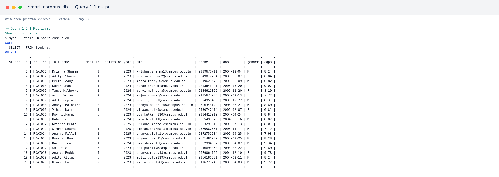

*Query 1.1 output screenshot — **PRINT THIS ASSET:** `assets/query_outputs/q01_01_retrieval_output_01.png`*

---

### Query 1.2 — Show name, roll number and cgpa of students, highest cgpa first

**Category:** Retrieval  
**Purpose:** Show name, roll number and cgpa of students, highest cgpa first

```sql
SELECT full_name, roll_no, cgpa FROM Student ORDER BY cgpa DESC;
```

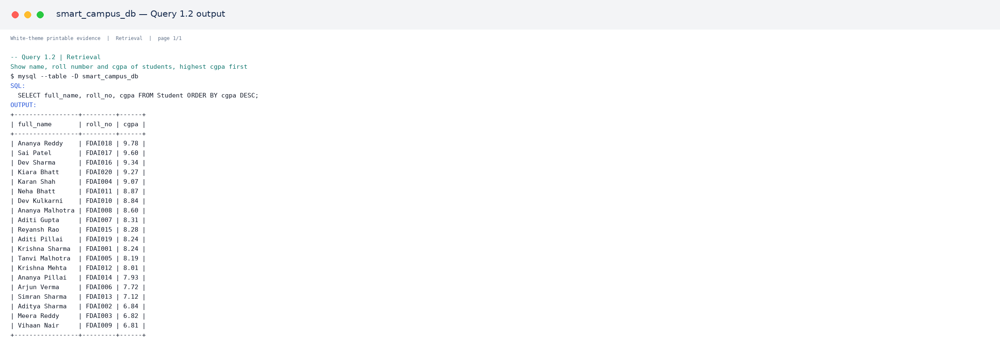

*Query 1.2 output screenshot — **PRINT THIS ASSET:** `assets/query_outputs/q01_02_retrieval_output_01.png`*

---

### Query 1.3 — Show all faculty members from the Artificial Intelligence department

**Category:** Retrieval  
**Purpose:** Show all faculty members from the Artificial Intelligence department

```sql
SELECT full_name, designation, email
FROM Faculty
WHERE dept_id = (SELECT dept_id FROM Department WHERE dept_name = 'Artificial Intelligence');
```

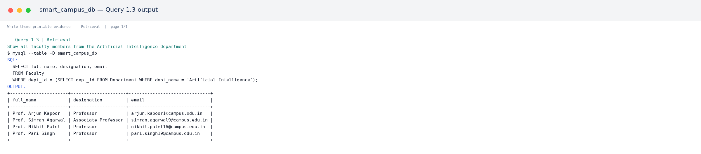

*Query 1.3 output screenshot — **PRINT THIS ASSET:** `assets/query_outputs/q01_03_retrieval_output_01.png`*

---

### Query 1.4 — Show students who took admission in 2024

**Category:** Retrieval  
**Purpose:** Show students who took admission in 2024

```sql
SELECT roll_no, full_name, admission_year FROM Student WHERE admission_year = 2024;
```

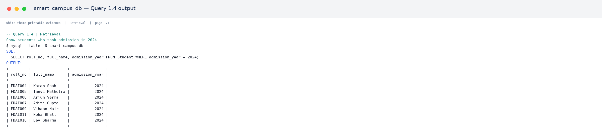

*Query 1.4 output screenshot — **PRINT THIS ASSET:** `assets/query_outputs/q01_04_retrieval_output_01.png`*

---

### Query 1.5 — Show all courses that carry 4 credits

**Category:** Retrieval  
**Purpose:** Show all courses that carry 4 credits

```sql
SELECT course_name, credits, semester FROM Course WHERE credits = 4;
```

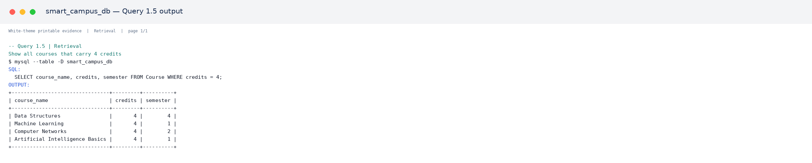

*Query 1.5 output screenshot — **PRINT THIS ASSET:** `assets/query_outputs/q01_05_retrieval_output_01.png`*

---

### Query 1.6 — Show all placement drives offering package above 8 LPA

**Category:** Retrieval  
**Purpose:** Show all placement drives offering package above 8 LPA

```sql
SELECT company_name, drive_date, package_offered FROM Placement_Drive WHERE package_offered > 8;
```

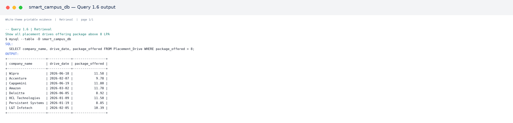

*Query 1.6 output screenshot — **PRINT THIS ASSET:** `assets/query_outputs/q01_06_retrieval_output_01.png`*

---

### Query 1.7 — Show top 5 students by cgpa

**Category:** Retrieval  
**Purpose:** Show top 5 students by cgpa

```sql
SELECT full_name, roll_no, cgpa FROM Student ORDER BY cgpa DESC LIMIT 5;
```

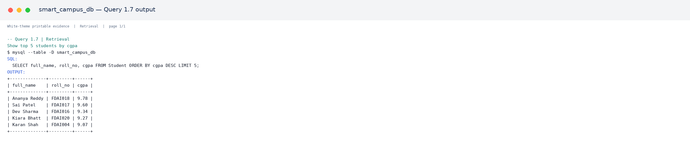

*Query 1.7 output screenshot — **PRINT THIS ASSET:** `assets/query_outputs/q01_07_retrieval_output_01.png`*

---

### Query 1.8 — Show all exams scheduled after 1st May 2026

**Category:** Retrieval  
**Purpose:** Show all exams scheduled after 1st May 2026

```sql
SELECT exam_name, exam_date, max_marks FROM Examination WHERE exam_date > '2026-05-01';
```

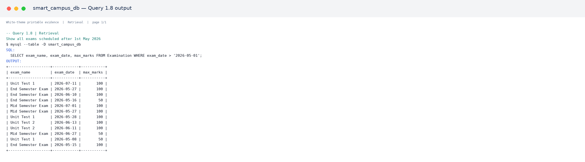

*Query 1.8 output screenshot — **PRINT THIS ASSET:** `assets/query_outputs/q01_08_retrieval_output_01.png`*

---

### Query 1.9 — Show student details along with their department name

**Category:** Retrieval  
**Purpose:** Show student details along with their department name

```sql
SELECT s.roll_no, s.full_name, d.dept_name
FROM Student s, Department d
WHERE s.dept_id = d.dept_id;
```

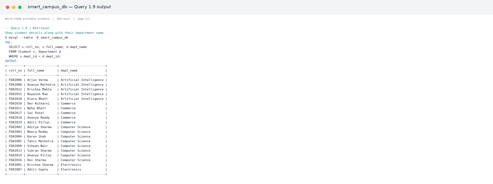

*Query 1.9 output screenshot — **PRINT THIS ASSET:** `assets/query_outputs/q01_09_retrieval_output_01.png`*

---

### Query 1.10 — Show distinct designations used by faculty members

**Category:** Retrieval  
**Purpose:** Show distinct designations used by faculty members

```sql
SELECT DISTINCT designation FROM Faculty;


-- ***********************************************************
-- 2. AGGREGATE FUNCTION QUERIES (5)
-- ***********************************************************
```

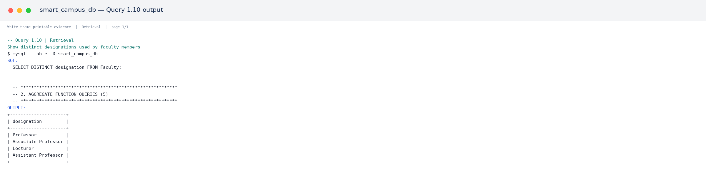

*Query 1.10 output screenshot — **PRINT THIS ASSET:** `assets/query_outputs/q01_10_retrieval_output_01.png`*

---

### Query 2.1 — Total number of students in the campus

**Category:** Aggregate Function  
**Purpose:** Total number of students in the campus

```sql
SELECT COUNT(*) AS total_students FROM Student;
```

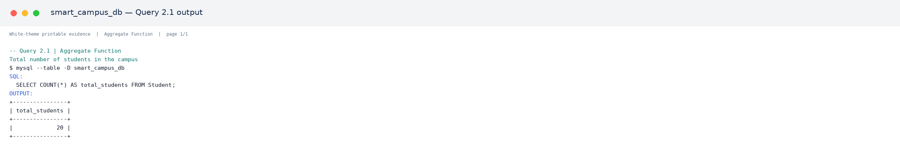

*Query 2.1 output screenshot — **PRINT THIS ASSET:** `assets/query_outputs/q02_01_aggregate_output_01.png`*

---

### Query 2.2 — Average cgpa of all students

**Category:** Aggregate Function  
**Purpose:** Average cgpa of all students

```sql
SELECT ROUND(AVG(cgpa),2) AS average_cgpa FROM Student;
```

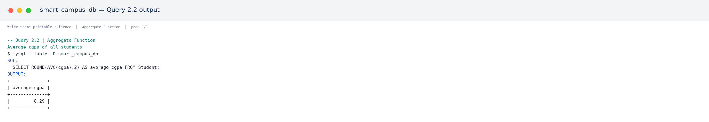

*Query 2.2 output screenshot — **PRINT THIS ASSET:** `assets/query_outputs/q02_02_aggregate_output_01.png`*

---

### Query 2.3 — Highest and lowest package offered across all placement drives

**Category:** Aggregate Function  
**Purpose:** Highest and lowest package offered across all placement drives

```sql
SELECT MAX(package_offered) AS highest_package, MIN(package_offered) AS lowest_package
FROM Placement_Drive;
```

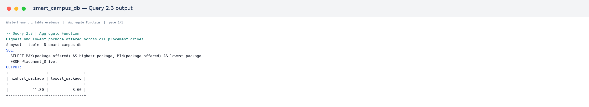

*Query 2.3 output screenshot — **PRINT THIS ASSET:** `assets/query_outputs/q02_03_aggregate_output_01.png`*

---

### Query 2.4 — Number of students in each department

**Category:** Aggregate Function  
**Purpose:** Number of students in each department

```sql
SELECT d.dept_name, COUNT(s.student_id) AS total_students
FROM Department d
LEFT JOIN Student s ON d.dept_id = s.dept_id
GROUP BY d.dept_name;
```

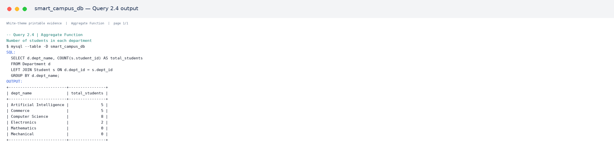

*Query 2.4 output screenshot — **PRINT THIS ASSET:** `assets/query_outputs/q02_04_aggregate_output_01.png`*

---

### Query 2.5 — Total salary paid by the campus to faculty of each department

**Category:** Aggregate Function  
**Purpose:** Total salary paid by the campus to faculty of each department

```sql
SELECT d.dept_name, SUM(f.salary) AS total_salary
FROM Department d
JOIN Faculty f ON d.dept_id = f.dept_id
GROUP BY d.dept_name;


-- ***********************************************************
-- 3. JOIN QUERIES (5)
-- ***********************************************************
```

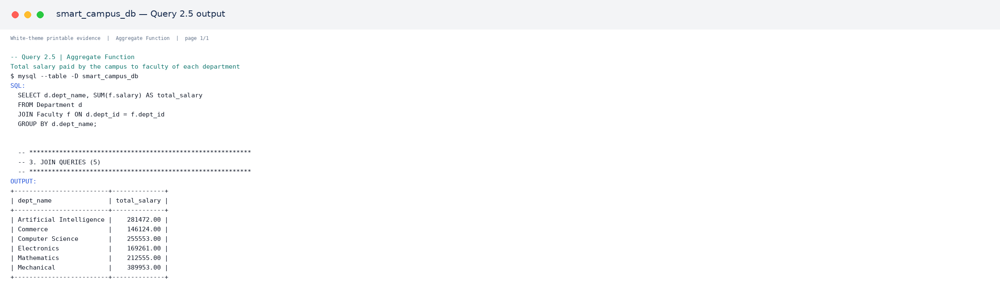

*Query 2.5 output screenshot — **PRINT THIS ASSET:** `assets/query_outputs/q02_05_aggregate_output_01.png`*

---

### Query 3.1 — List every student with the course they attend and the class faculty (INNER JOIN, 3 tables)

**Category:** JOIN  
**Purpose:** List every student with the course they attend and the class faculty (INNER JOIN, 3 tables)

```sql
SELECT s.full_name AS student, c.course_name, f.full_name AS faculty
FROM Attendance a
JOIN Student s ON a.student_id = s.student_id
JOIN Course c ON a.course_id = c.course_id
JOIN Faculty f ON c.faculty_id = f.faculty_id;
```

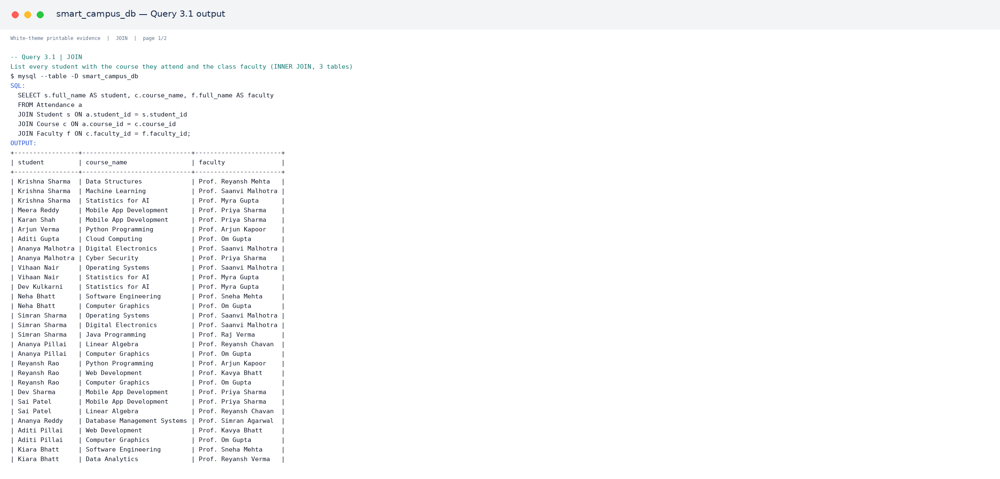

*Query 3.1 output screenshot — **PRINT THIS ASSET:** `assets/query_outputs/q03_01_join_output_01.png`*


*Query 3.1 output screenshot — **PRINT THIS ASSET:** `assets/query_outputs/q03_01_join_output_02.png`*

---

### Query 3.2 — List each student's marks together with the exam and course name

**Category:** JOIN  
**Purpose:** List each student's marks together with the exam and course name

```sql
SELECT s.full_name AS student, e.exam_name, c.course_name, r.marks_obtained, r.grade
FROM Result r
JOIN Student s ON r.student_id = s.student_id
JOIN Examination e ON r.exam_id = e.exam_id
JOIN Course c ON e.course_id = c.course_id;
```

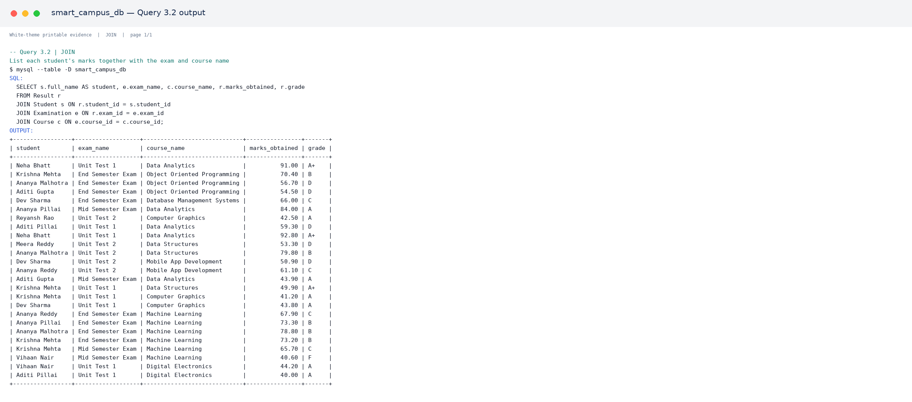

*Query 3.2 output screenshot — **PRINT THIS ASSET:** `assets/query_outputs/q03_02_join_output_01.png`*

---

### Query 3.3 — LEFT JOIN - show every student even if they never applied for placement

**Category:** JOIN  
**Purpose:** LEFT JOIN - show every student even if they never applied for placement

```sql
SELECT s.full_name, pd.company_name, pr.status
FROM Student s
LEFT JOIN Placement_Record pr ON s.student_id = pr.student_id
LEFT JOIN Placement_Drive pd ON pr.drive_id = pd.drive_id
ORDER BY s.full_name;
```

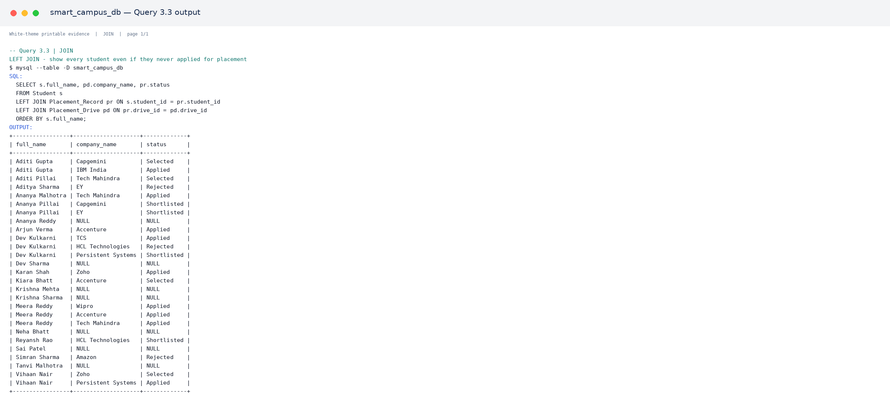

*Query 3.3 output screenshot — **PRINT THIS ASSET:** `assets/query_outputs/q03_03_join_output_01.png`*

---

### Query 3.4 — List courses along with the department and the faculty teaching them

**Category:** JOIN  
**Purpose:** List courses along with the department and the faculty teaching them

```sql
SELECT c.course_name, d.dept_name, f.full_name AS faculty_name
FROM Course c
JOIN Department d ON c.dept_id = d.dept_id
JOIN Faculty f ON c.faculty_id = f.faculty_id;
```

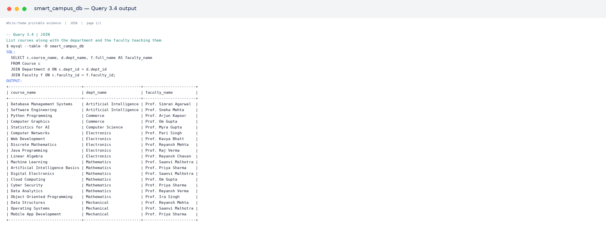

*Query 3.4 output screenshot — **PRINT THIS ASSET:** `assets/query_outputs/q03_04_join_output_01.png`*

---

### Query 3.5 — RIGHT JOIN - show all placement drives and the students placed in them, if any

**Category:** JOIN  
**Purpose:** RIGHT JOIN - show all placement drives and the students placed in them, if any

```sql
SELECT pd.company_name, s.full_name, pr.status
FROM Placement_Record pr
RIGHT JOIN Placement_Drive pd ON pr.drive_id = pd.drive_id
LEFT JOIN Student s ON pr.student_id = s.student_id;


-- ***********************************************************
-- 4. NESTED (SUBQUERY) QUERIES (5)
-- ***********************************************************
```

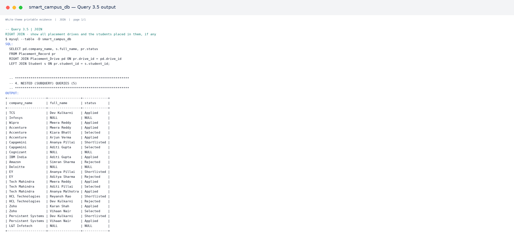

*Query 3.5 output screenshot — **PRINT THIS ASSET:** `assets/query_outputs/q03_05_join_output_01.png`*

---

### Query 4.1 — Students whose cgpa is above the campus average

**Category:** Nested Query  
**Purpose:** Students whose cgpa is above the campus average

```sql
SELECT full_name, cgpa
FROM Student
WHERE cgpa > (SELECT AVG(cgpa) FROM Student);
```

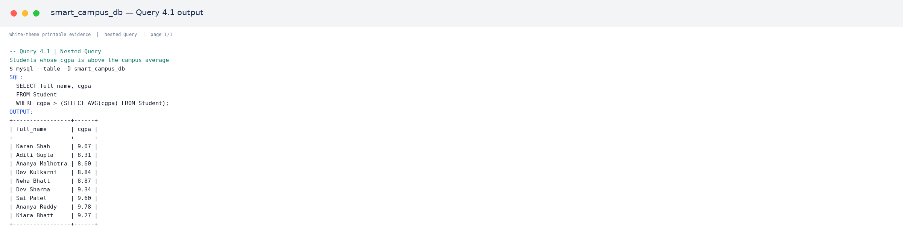

*Query 4.1 output screenshot — **PRINT THIS ASSET:** `assets/query_outputs/q04_01_nested_query_output_01.png`*

---

### Query 4.2 — Faculty who earn more than the average salary of their own department

**Category:** Nested Query  
**Purpose:** Faculty who earn more than the average salary of their own department

```sql
SELECT full_name, dept_id, salary
FROM Faculty f
WHERE salary > (
    SELECT AVG(salary) FROM Faculty WHERE dept_id = f.dept_id
);
```

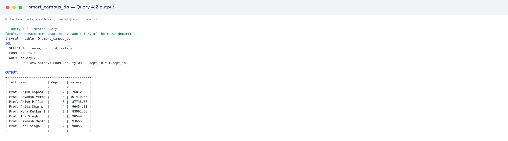

*Query 4.2 output screenshot — **PRINT THIS ASSET:** `assets/query_outputs/q04_02_nested_query_output_01.png`*

---

### Query 4.3 — Students who have been selected in at least one placement drive

**Category:** Nested Query  
**Purpose:** Students who have been selected in at least one placement drive

```sql
SELECT full_name, roll_no
FROM Student
WHERE student_id IN (
    SELECT student_id FROM Placement_Record WHERE status = 'Selected'
);
```

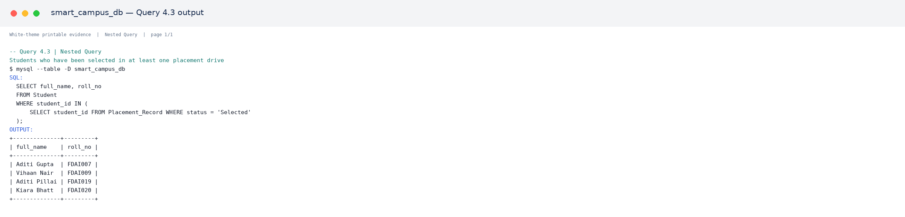

*Query 4.3 output screenshot — **PRINT THIS ASSET:** `assets/query_outputs/q04_03_nested_query_output_01.png`*

---

### Query 4.4 — Courses that currently have no exam scheduled

**Category:** Nested Query  
**Purpose:** Courses that currently have no exam scheduled

```sql
SELECT course_name
FROM Course
WHERE course_id NOT IN (
    SELECT DISTINCT course_id FROM Examination
);
```

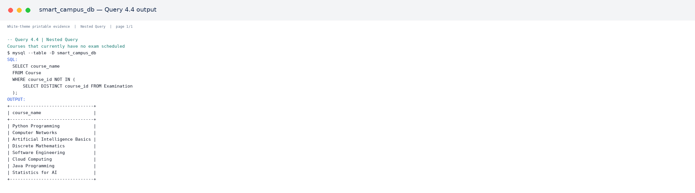

*Query 4.4 output screenshot — **PRINT THIS ASSET:** `assets/query_outputs/q04_04_nested_query_output_01.png`*

---

### Query 4.5 — Student with the highest marks in each exam (correlated subquery)

**Category:** Nested Query  
**Purpose:** Student with the highest marks in each exam (correlated subquery)

```sql
SELECT e.exam_name, s.full_name, r.marks_obtained
FROM Result r
JOIN Examination e ON r.exam_id = e.exam_id
JOIN Student s ON r.student_id = s.student_id
WHERE r.marks_obtained = (
    SELECT MAX(r2.marks_obtained) FROM Result r2 WHERE r2.exam_id = r.exam_id
);


-- ***********************************************************
-- 5. UPDATE QUERIES (5)
-- ***********************************************************
```

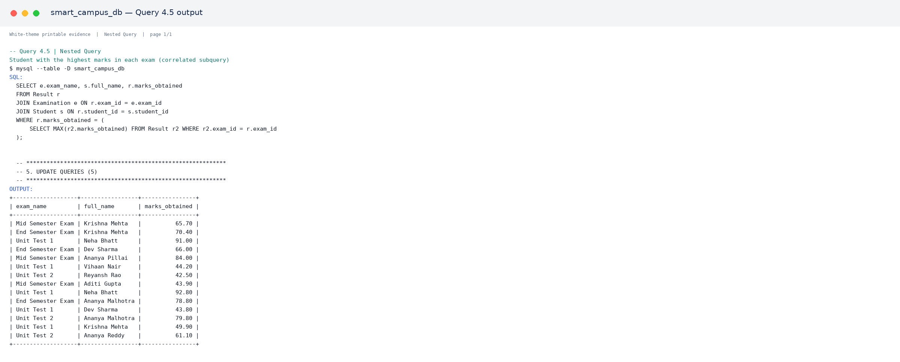

*Query 4.5 output screenshot — **PRINT THIS ASSET:** `assets/query_outputs/q04_05_nested_query_output_01.png`*

---

### Query 5.1 — Update a student's cgpa after result declaration

**Category:** UPDATE  
**Purpose:** Update a student's cgpa after result declaration

```sql
UPDATE Student SET cgpa = 9.10 WHERE roll_no = 'FDAI001';
```

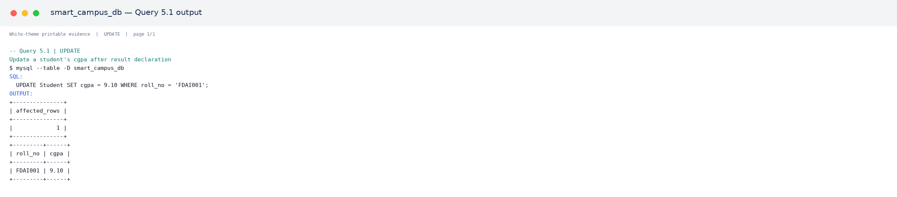

*Query 5.1 output screenshot — **PRINT THIS ASSET:** `assets/query_outputs/q05_01_update_output_01.png`*

---

### Query 5.2 — Give a 10% salary hike to all Professors

**Category:** UPDATE  
**Purpose:** Give a 10% salary hike to all Professors

```sql
UPDATE Faculty SET salary = salary * 1.10 WHERE designation = 'Professor';
```

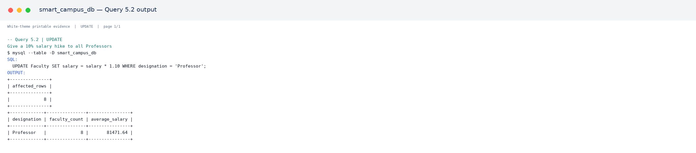

*Query 5.2 output screenshot — **PRINT THIS ASSET:** `assets/query_outputs/q05_02_update_output_01.png`*

---

### Query 5.3 — Mark a placement application as Selected

**Category:** UPDATE  
**Purpose:** Mark a placement application as Selected

```sql
UPDATE Placement_Record SET status = 'Selected'
WHERE student_id = 3 AND drive_id = 2;
```

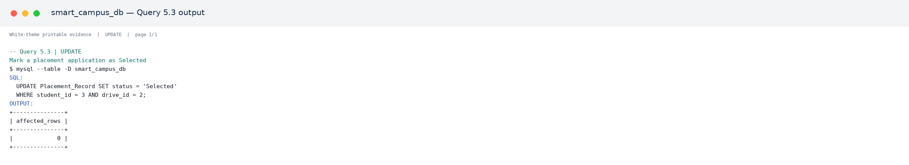

*Query 5.3 output screenshot — **PRINT THIS ASSET:** `assets/query_outputs/q05_03_update_output_01.png`*

---

### Query 5.4 — Correct the max marks of an exam

**Category:** UPDATE  
**Purpose:** Correct the max marks of an exam

```sql
UPDATE Examination SET max_marks = 100 WHERE exam_name = 'Unit Test 1' AND max_marks <> 100;
```

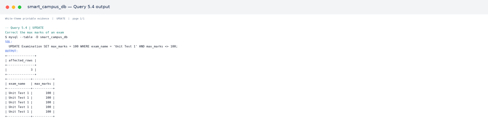

*Query 5.4 output screenshot — **PRINT THIS ASSET:** `assets/query_outputs/q05_04_update_output_01.png`*

---

### Query 5.5 — Update phone number of a student

**Category:** UPDATE  
**Purpose:** Update phone number of a student

```sql
UPDATE Student SET phone = '9876543210' WHERE roll_no = 'FDAI002';


-- ***********************************************************
-- 6. DELETE QUERIES (5)
-- ***********************************************************
```

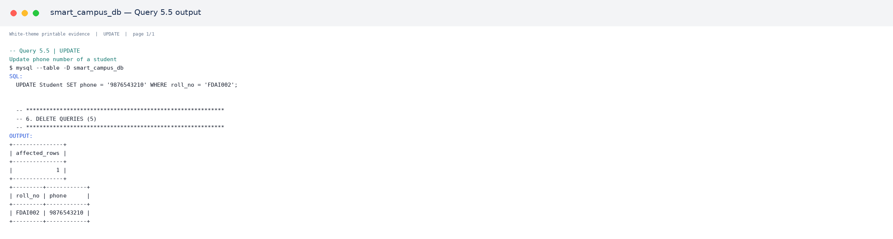

*Query 5.5 output screenshot — **PRINT THIS ASSET:** `assets/query_outputs/q05_05_update_output_01.png`*

---

### Query 6.1 — Remove a single wrong attendance entry

**Category:** DELETE  
**Purpose:** Remove a single wrong attendance entry

```sql
DELETE FROM Attendance WHERE attendance_id = 30;
```

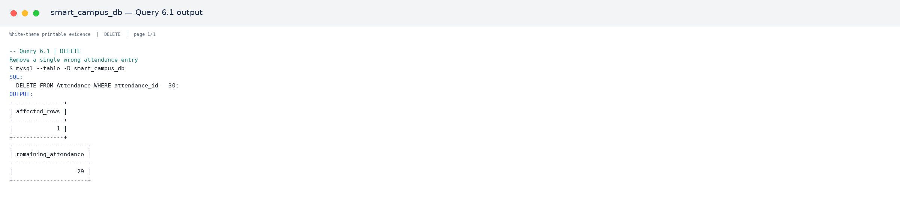

*Query 6.1 output screenshot — **PRINT THIS ASSET:** `assets/query_outputs/q06_01_delete_output_01.png`*

---

### Query 6.2 — Remove placement applications that were rejected before 2026

**Category:** DELETE  
**Purpose:** Remove placement applications that were rejected before 2026

```sql
DELETE FROM Placement_Record WHERE status = 'Rejected' AND placement_id = 20;
```

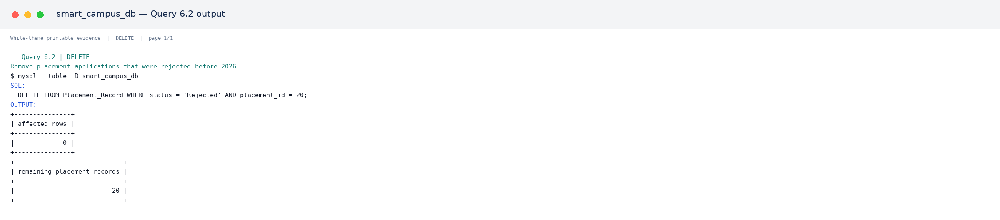

*Query 6.2 output screenshot — **PRINT THIS ASSET:** `assets/query_outputs/q06_02_delete_output_01.png`*

---

### Query 6.3 — Remove a faculty record that was entered by mistake (course reassigned first)

**Category:** DELETE  
**Purpose:** Remove a faculty record that was entered by mistake (course reassigned first)

```sql
DELETE FROM Faculty WHERE faculty_id = 20;
```

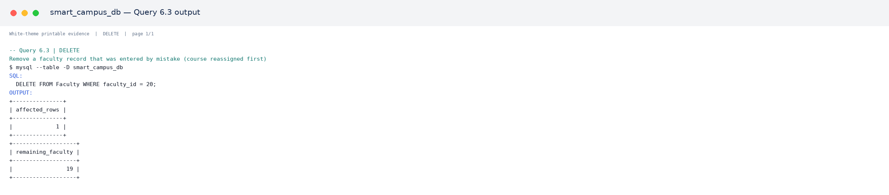

*Query 6.3 output screenshot — **PRINT THIS ASSET:** `assets/query_outputs/q06_03_delete_output_01.png`*

---

### Query 6.4 — Remove exam records with zero marks entered by mistake

**Category:** DELETE  
**Purpose:** Remove exam records with zero marks entered by mistake

```sql
DELETE FROM Result WHERE marks_obtained = 0;
```

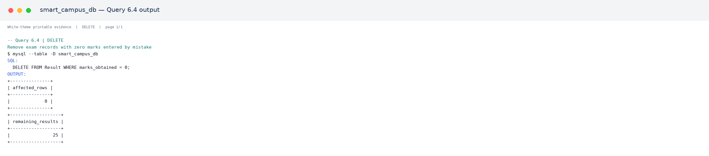

*Query 6.4 output screenshot — **PRINT THIS ASSET:** `assets/query_outputs/q06_04_delete_output_01.png`*

---

### Query 6.5 — Remove a placement drive that got cancelled

**Category:** DELETE  
**Purpose:** Remove a placement drive that got cancelled

```sql
DELETE FROM Placement_Drive WHERE drive_id = 15;


-- ***********************************************************
-- 7. ALTER TABLE QUERIES (5)
-- ***********************************************************
```

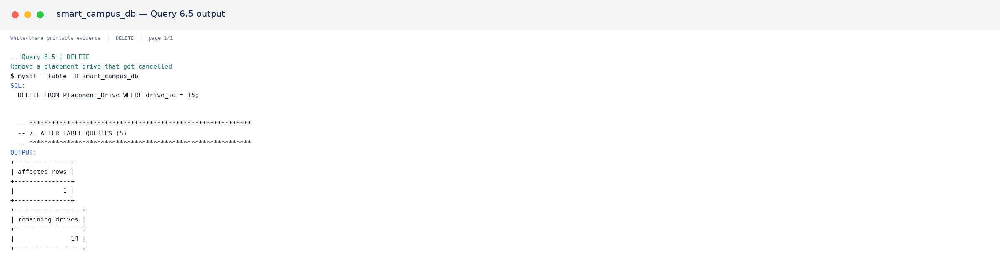

*Query 6.5 output screenshot — **PRINT THIS ASSET:** `assets/query_outputs/q06_05_delete_output_01.png`*

---

### Query 7.1 — Add a new column to store student's blood group

**Category:** ALTER TABLE  
**Purpose:** Add a new column to store student's blood group

```sql
ALTER TABLE Student ADD COLUMN blood_group VARCHAR(5);
```

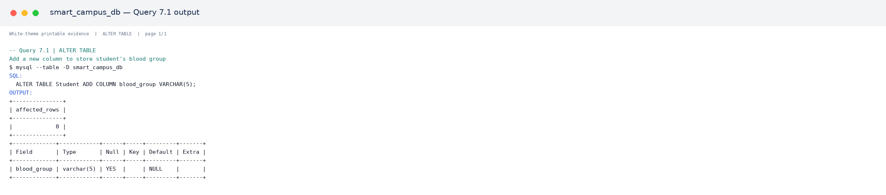

*Query 7.1 output screenshot — **PRINT THIS ASSET:** `assets/query_outputs/q07_01_alter_table_output_01.png`*

---

### Query 7.2 — Add a new column to store the mode of a class (Online/Offline)

**Category:** ALTER TABLE  
**Purpose:** Add a new column to store the mode of a class (Online/Offline)

```sql
ALTER TABLE Course ADD COLUMN mode VARCHAR(10) DEFAULT 'Offline';
```

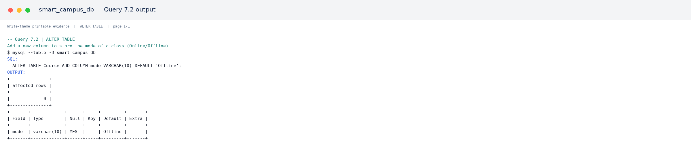

*Query 7.2 output screenshot — **PRINT THIS ASSET:** `assets/query_outputs/q07_02_alter_table_output_01.png`*

---

### Query 7.3 — Modify phone number column length in Faculty table

**Category:** ALTER TABLE  
**Purpose:** Modify phone number column length in Faculty table

```sql
ALTER TABLE Faculty MODIFY COLUMN phone VARCHAR(20);
```

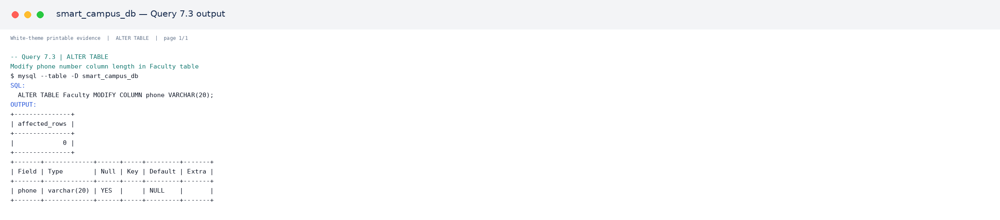

*Query 7.3 output screenshot — **PRINT THIS ASSET:** `assets/query_outputs/q07_03_alter_table_output_01.png`*

---

### Query 7.4 — Rename a column in Placement_Drive for clarity

**Category:** ALTER TABLE  
**Purpose:** Rename a column in Placement_Drive for clarity

```sql
ALTER TABLE Placement_Drive RENAME COLUMN package_offered TO package_lpa;
```

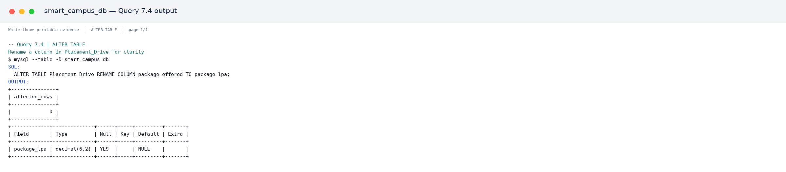

*Query 7.4 output screenshot — **PRINT THIS ASSET:** `assets/query_outputs/q07_04_alter_table_output_01.png`*

---

### Query 7.5 — Drop the unused blood_group column (shown for reference/undo)

**Category:** ALTER TABLE  
**Purpose:** Drop the unused blood_group column (shown for reference/undo)

```sql
ALTER TABLE Student DROP COLUMN blood_group;


-- ***********************************************************
-- 8. PATTERN MATCHING QUERIES - LIKE (5)
-- ***********************************************************
```

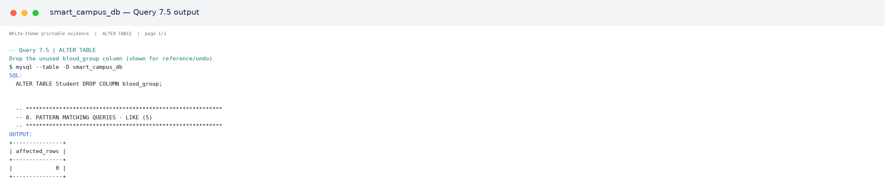

*Query 7.5 output screenshot — **PRINT THIS ASSET:** `assets/query_outputs/q07_05_alter_table_output_01.png`*

---

### Query 8.1 — Students whose name starts with 'A'

**Category:** Pattern Matching (LIKE)  
**Purpose:** Students whose name starts with 'A'

```sql
SELECT full_name FROM Student WHERE full_name LIKE 'A%';
```

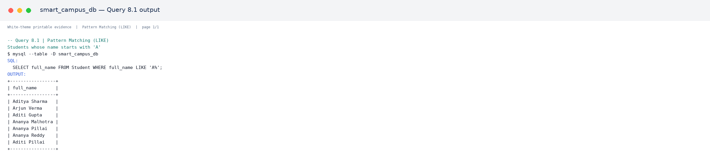

*Query 8.1 output screenshot — **PRINT THIS ASSET:** `assets/query_outputs/q08_01_like_output_01.png`*

---

### Query 8.2 — Faculty whose email is on the campus.edu.in domain

**Category:** Pattern Matching (LIKE)  
**Purpose:** Faculty whose email is on the campus.edu.in domain

```sql
SELECT full_name, email FROM Faculty WHERE email LIKE '%@campus.edu.in';
```

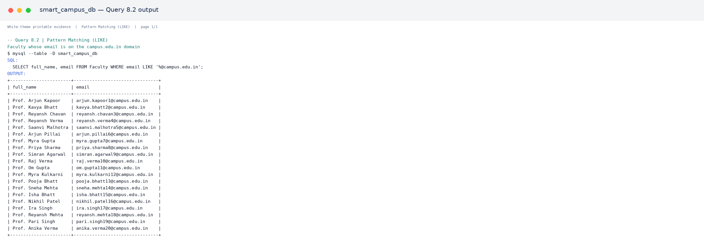

*Query 8.2 output screenshot — **PRINT THIS ASSET:** `assets/query_outputs/q08_02_like_output_01.png`*

---

### Query 8.3 — Courses with 'Data' anywhere in the course name

**Category:** Pattern Matching (LIKE)  
**Purpose:** Courses with 'Data' anywhere in the course name

```sql
SELECT course_name FROM Course WHERE course_name LIKE '%Data%';
```

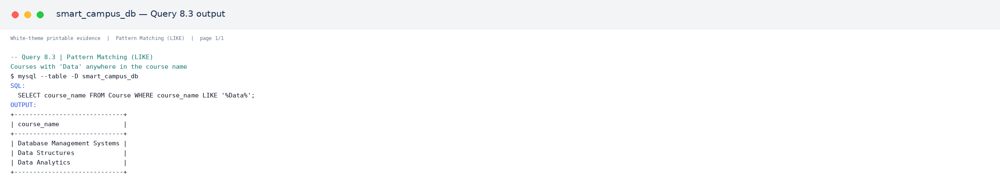

*Query 8.3 output screenshot — **PRINT THIS ASSET:** `assets/query_outputs/q08_03_like_output_01.png`*

---

### Query 8.4 — Companies whose name ends with 'a'

**Category:** Pattern Matching (LIKE)  
**Purpose:** Companies whose name ends with 'a'

```sql
SELECT company_name FROM Placement_Drive WHERE company_name LIKE '%a';
```

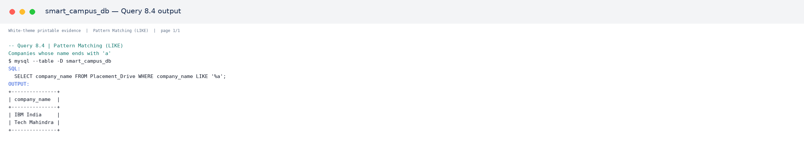

*Query 8.4 output screenshot — **PRINT THIS ASSET:** `assets/query_outputs/q08_04_like_output_01.png`*

---

### Query 8.5 — Students whose roll number matches the pattern FDAI0_1 (2nd last digit is 1)

**Category:** Pattern Matching (LIKE)  
**Purpose:** Students whose roll number matches the pattern FDAI0_1 (2nd last digit is 1)

```sql
SELECT roll_no, full_name FROM Student WHERE roll_no LIKE 'FDAI0_1';
```

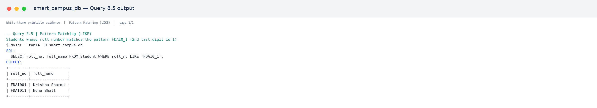

*Query 8.5 output screenshot — **PRINT THIS ASSET:** `assets/query_outputs/q08_05_like_output_01.png`*

---

## PART F — REPORT

### Challenges Faced

| Challenge | Short solution |
|---|---|
| Referential integrity | Created parent tables first and used foreign keys. |
| Duplicate data | Used UNIQUE constraints and 3NF separation. |
| Child-record handling | Applied ON DELETE CASCADE or SET NULL. |
| Query coverage | Organized the source into eight clearly labelled categories. |
| Evidence volume | Stored every output screenshot systematically by query number. |

### Learning Outcomes

This project demonstrates requirement analysis, ER and relational design, primary and foreign keys, 3NF normalization, integrity constraints, seed data, aggregate functions, JOINs, nested queries, DML operations, schema modification, and pattern matching.

### Code Screenshot Index

All source-code screenshots use a white theme with dark text for printing.

| Screenshot | Source range |
|---|---:|
| [`code_01_lines_001_048.png`](./assets/code_screenshots/code_01_lines_001_048.png) | 001–048 |
| [`code_02_lines_049_096.png`](./assets/code_screenshots/code_02_lines_049_096.png) | 049–096 |
| [`code_03_lines_097_144.png`](./assets/code_screenshots/code_03_lines_097_144.png) | 097–144 |
| [`code_04_lines_145_192.png`](./assets/code_screenshots/code_04_lines_145_192.png) | 145–192 |
| [`code_05_lines_193_240.png`](./assets/code_screenshots/code_05_lines_193_240.png) | 193–240 |
| [`code_06_lines_241_288.png`](./assets/code_screenshots/code_06_lines_241_288.png) | 241–288 |
| [`code_07_lines_289_336.png`](./assets/code_screenshots/code_07_lines_289_336.png) | 289–336 |
| [`code_08_lines_337_384.png`](./assets/code_screenshots/code_08_lines_337_384.png) | 337–384 |
| [`code_09_lines_385_432.png`](./assets/code_screenshots/code_09_lines_385_432.png) | 385–432 |
| [`code_10_lines_433_480.png`](./assets/code_screenshots/code_10_lines_433_480.png) | 433–480 |
| [`code_11_lines_481_528.png`](./assets/code_screenshots/code_11_lines_481_528.png) | 481–528 |
| [`code_12_lines_529_566.png`](./assets/code_screenshots/code_12_lines_529_566.png) | 529–566 |

### Submission Guidance

Write the explanatory sections manually using the DOCX as the reference. Print the complete SQL source or the white-theme code screenshots. For every query, print the matching output image named directly below it and attach it as evidence. The teacher brief specifies a 12–20 page report, but this expanded reference copy is intentionally approximately 40 pages so that every output can be studied and reproduced.

## References

1. [Teacher-provided assignment brief](./FYAIDBMSASSIGNMENT.pdf)  
2. [Published project repository](https://github.com/codeXparadise/Assignments/tree/main/DBMS/UNIT%201)  
3. [MySQL 8.0 Reference Manual](https://dev.mysql.com/doc/refman/8.0/en/)  
4. [Third Normal Form reference](https://en.wikipedia.org/wiki/Third_normal_form)

**Prepared for Vishal Prajapati · FDAI044-A · FY-BSC AI · Faculty In-charge: Onkar Raotole**
